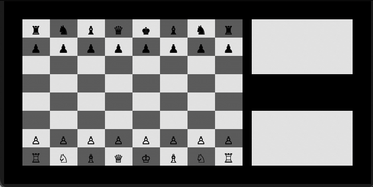

# Chess-AI

A concole base application to play chess on. Can be played with 2 human players, or can be played against an AI i have created. The AI uses minimax with
alpha-beta pruning to determine its next move. The AI only searches 3 moves ahead, so it is not a very good AI at the moment. It will take pieces it can, protect
pieces if it can, but it doesn't do much more than that so it's fairly easy to beat. It is written in python and uses the curses library to draw the GUI into the 
terminal. In the future I plan to improve this using techniques such as
* More efficient data representation of the game state to allow for faster computations and a deeper search tree
* Transposition table to save recently computed game states
* Iterative deepening
* Better move ordering to improve the efficiency of alpha beta pruning

Type `./chess -h` for help with the arguments to the game

The game is controlled using the arrow keys and enter. First select the piece you want to move with the arrow keys and hit enter. 
The possible moves the piece can make will be displayed. Select the move you want to make with the arrow keys and hit enter to finish your turn.

This has been tested on the Terminal app on MacOS. It should work on Linux and Windows, but has not been tested

### Demo usage of a human player (white) playing the computer AI (black)

